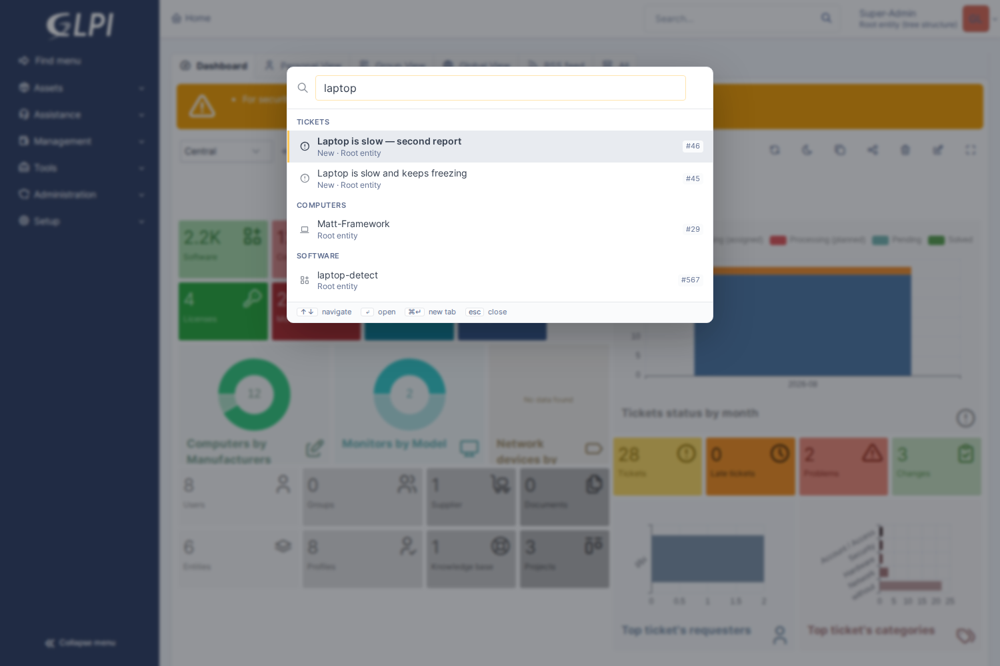

# GLPI Command Palette

A GitHub-style **Ctrl/Cmd+K** launcher for GLPI. One box that reaches records,
every menu destination, and a handful of named actions — without leaving the
keyboard.



## Why, when core has "Find menu"?

GLPI 11 already ships a fuzzy finder on **Ctrl+Alt+G**. It is a *menu* finder:
`Html::getMenuFuzzySearchList()` returns navigation entries, so it can take you
to the ticket list but cannot find a ticket. This palette searches records too,
and folds the menu in as one more result group.

The two coexist — this plugin does not touch core's binding.

| | Find menu (core) | Command palette |
|---|---|---|
| Shortcut | Ctrl+Alt+G | Ctrl/Cmd+K (configurable) |
| Menu destinations | ✔ | ✔ |
| Records (tickets, assets, users…) | ✘ | ✔ via global search |
| Type scoping | ✘ | `computer: dell` |
| Jump by id | ✘ | `#4821` |
| Recents | ✘ | ✔ (browser-local) |

## Using it

| Input | Does |
|---|---|
| `laptop` | Searches records **and** commands |
| `>ticket` | Commands and menu only |
| `computer: dell` | Records of one type only |
| `#4821` | Offers a direct jump to that ticket |
| `↑` `↓` | Move selection |
| `↵` | Open |
| `⌘↵` / `Ctrl+↵` | Open in a new tab |
| `esc` | Close |

Type scoping accepts any of GLPI's 30 `globalsearch_types`, so the six searched
by default are not a ceiling — they are just what runs without being asked.

## Faster record search

Records are matched with GLPI's `contains`, which means they are matched by
word: type `priner` and nothing comes back, because the word is not there.

If **glpi-search** is installed and indexing, the palette takes its record
results from there instead — typos tolerated, matching from the first
character, and an answer in single-digit milliseconds rather than a `contains`
sweep across every displayed column of every type.

Types that plugin is *not* indexing still go through GLPI's own search, and so
does every type if Meilisearch is unreachable — the bridge reports that it
could not answer, and the palette falls back rather than showing an empty list.
Installing it can make results faster; it cannot make them disappear.

The switch is under **Setup → Plugins → Command palette**, and it is honest
about the state of the other plugin — installed, indexing, or neither. With
glpi-search absent, inactive, or holding no index, the palette is exactly what
it was before: `src/FastSearch.php` is the only file that names it, every
reference is a string rather than an import, and every call is behind a guard. A
navigation tool people reach for a hundred times a day does not get to acquire a
hard dependency on an optional plugin.

## Install

```bash
# from the GLPI root — the directory has to be named for the plugin
# key, which is not the repository name
git clone https://github.com/bijstaan/glpi-palette.git plugins/glpipalette
php bin/console plugin:install -u glpi glpipalette
php bin/console plugin:activate glpipalette
```

Settings: **Setup → Plugins → Command Palette**.

| Setting | Default |
|---|---|
| Searched by default | Ticket, Change, Problem, Computer, User, Software |
| Results per itemtype | 5 |
| Minimum characters | 2 |
| Bind Ctrl/Cmd+K | on |
| Bind `/` | off |

### Why the default type list is short

Records go through `Search::getDatas()` with a `view contains …` criterion —
the same path `front/search.php` uses for the header search box. That inherits
GLPI's entity restrictions and profile rights for free, which is the whole
reason to use it rather than hand-rolled `LIKE` queries that would quietly
return rows the user may not see.

The cost is that **each itemtype is its own query across every displayed
column**. Measured on a near-empty dev database, a sweep of all 30 configured
types took ~140ms; that scales with real data, and a palette runs a query per
keystroke. Hence six types by default, a 2-character floor before records are
searched at all, a 180ms debounce, and abort-on-retype.

## How it works

Two very different latencies, handled differently:

```
Ctrl+K
  │
  ├─ bootstrap (once per page, prefetched when idle)
  │     commands + menu entries  ──► matched in the browser, instant
  │
  └─ search (per keystroke, debounced 180ms, abortable)
        Finder ──► Search::getDatas()  ──► grouped records
```

Commands and menu destinations are a bounded per-session list, so they are
fetched once and ranked client-side — the palette responds to the first
keystroke. Only records need the server.

Ranking is tiered: exact title → prefix → word-start → substring →
subsequence. The tiers matter more than the numbers; without them a
subsequence hit buried in a long menu path can outrank an exact match.

### Security notes

- **Scopes are bounded by `globalsearch_types`,** not "any class with a search
  engine". The scope name arrives from the browser and is used as a class
  name; an unbounded parameter there turns a search box into a way to probe
  tables the interface never meant to expose. `Config` is a real class and is
  correctly rejected.
- **`#id` jumps are resolved server-side** through `canViewItem()`, so the
  palette cannot be used to confirm which ids exist to someone with no rights
  to them.
- **Titles are rendered with `textContent`.** GLPI's search rows carry a
  `displayname` field of pre-rendered HTML complete with an inline `<script>`
  qtip initialiser; the plugin reads the raw name column instead and never
  hands markup to the DOM.
- **CSRF** rides the `X-Glpi-Csrf-Token` header, which GLPI 11's kernel
  validates *and preserves*. Sending it in the POST body instead would consume
  a token per keystroke and drain the session's pool within minutes.
- **Nothing is recorded server-side.** No tables; "recent" lives in
  `localStorage`, so what a technician looked at is not logged.

## Deliberately navigation-only

Every command opens something. None of them submit, assign, close, or delete.
A launcher that mutates on `Enter` is one mistyped keystroke from an accident,
and most of GLPI has no undo. Adding mutating actions is very doable but wants
a confirmation step designed for it first.

## Testing

```bash
cd glpi-palette/tests/browser && node palette-check.js
```

Covers opening, record search, `>` command mode, type scoping (asserting the
scoped result set is genuinely narrower than the unscoped one), `#id` jumps,
arrow navigation, Enter-to-open, recents, and Escape.

## Not in this version

- Mutating actions (see above).
- Server-side recents / cross-device history — intentional, see security notes.
- Fuzzy matching for *records*; those use GLPI's `contains` semantics, so
  `lptop` will not find "Laptop". Only commands and menu entries are fuzzy.

## Licence

GNU General Public License, version 3 or later — the same licence as GLPI.
This plugin is loaded into GLPI's process and extends its classes, so it is a
derivative work of GLPI and carries GLPI's licence. See [LICENSE](LICENSE).
